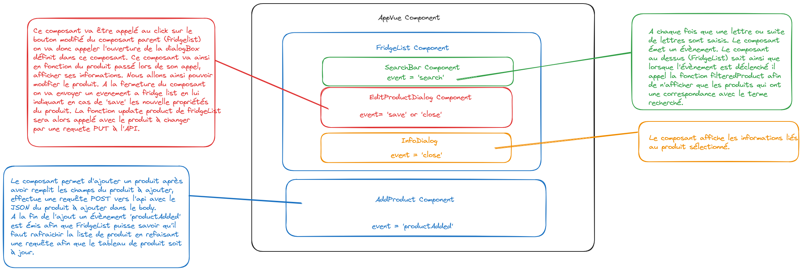
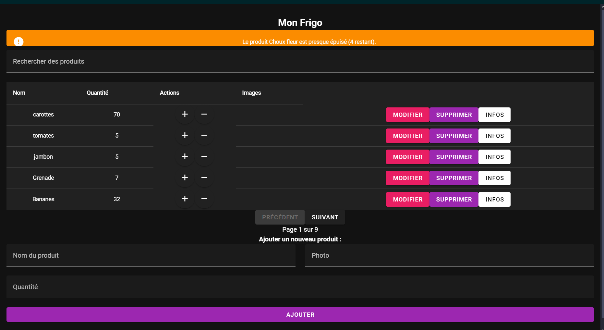
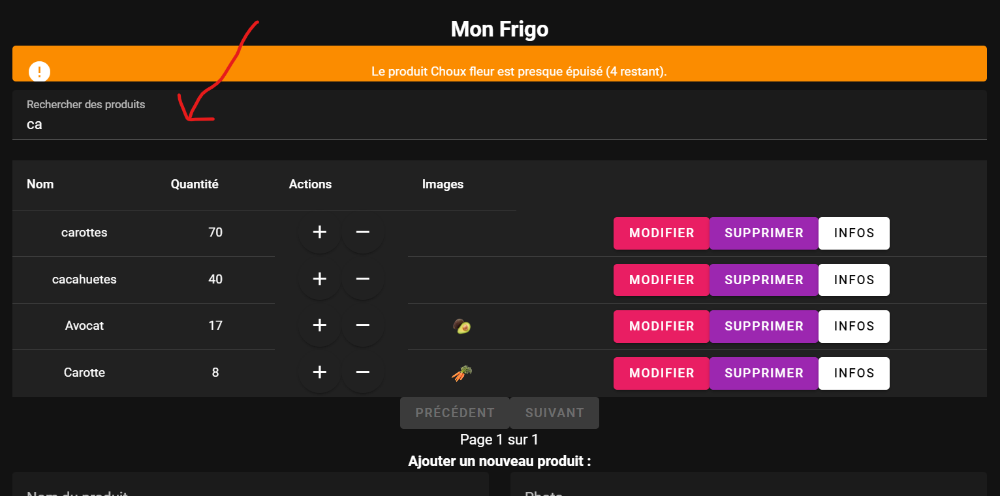
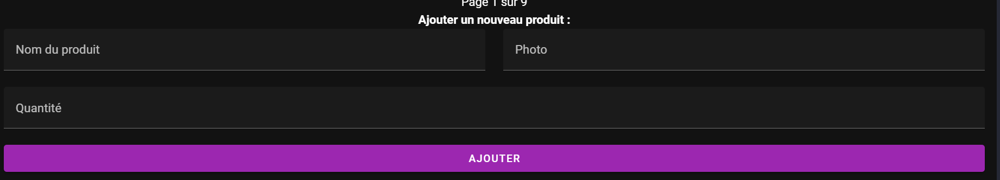
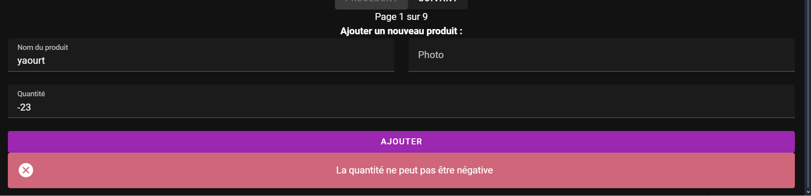
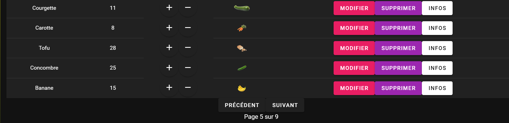
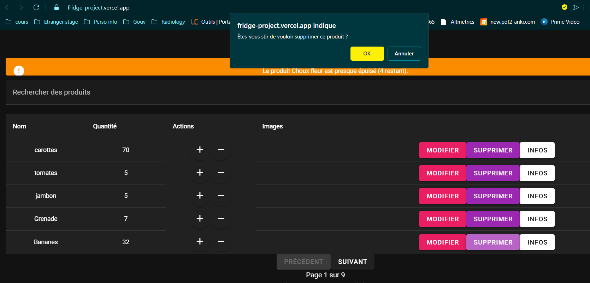
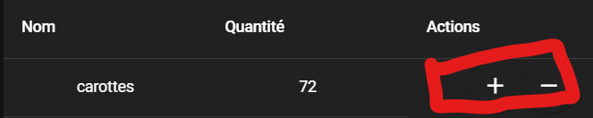

# Analyse du sujet :

Nous voulons gérer un frigo.

## Les fonctionnalités requises sont :

- Afficher le contenu du frigo
- Ajouter un nouveau produit au frigo { nomproduit, qte, photo (facultative) }
- Supprimer un produit du frigo totalement
- Ajouter 1 à la quantité d’un produit présent dans le frigo
- Supprimer 1 à la quantité d’un produit présent dans le frigo
- Rechercher des produits

## Analyse des composants à créer :

- App.vue : Notre composant principal qui sert de conteneur pour tous les autres composants.

- FridgeList.vue : Composant pour afficher la liste des produits du frigo.
- AddProduct.vue : Composant pour ajouter un nouveau produit au frigo.
- EditProductDialog.vue : Composant pour représenter sous forme de pop-up un produit dans la liste pour modification.
- InfoProductDialog.vue : Composant pour visualiser sous forme de pop-up un produit dans la liste
- SearchBar.vue : Composant pour rechercher des produits dans le frigo.

# Graphe décrivant l'architecture de mon application :

# Manuel utilisateur :

Le [site de ce devoir](https://fridge-project.vercel.app) est accessible ici.

## Page principale

A l'arrivée sur la page principale nous avons vue sur le tableau des produits présents dans le frigo.

### 1. Recherche d'un produit :

Afin de rechercher un produit dans le tableau, il vous suffit de taper votre terme à rechercher dans la barre de recherche. En effet lors de votre écriture/modification du terme à rechercher l'application, effectue des requêtes à l'api à chaque changement permettant une recherche fluide en temps réel lors de votre saisie afin d'améliorer l'expérience utilisateur.

### 2. Navigation dans l'affichage des produits contenus dans le frigo :

Afin d'améliorer l'expérience utilisateur, une pagination du tableau a également été mise en place. Permettant ainsi de naviguer dans les éléments à l'aide de différents boutons. En prenant en compte bien sûr que l'on ne puisse pas actionner le bouton précédent en étant sur la première page et de même le bouton suivant en étant sur la dernière page. Nous pouvons également observer une actualisation du numéro de pagination.

### 3. Ajouter un nouveau produit dans le frigo :

Pour ajouter un nouveau produit dans le frigo, cela se passe dans le formulaire situé en bas de la page.

Il suffit de completer les différents champs tels que le nom du produit sa quantité et le lien si il y a vers une image du produit.

/!\ Il vous sera impossible d'ajouter une quantité négative, une alerte apparaitra et vous devrait entrée une valeur valide pour pouvoir ajouter le produit.

Pour ce qui est de l'image, il vous suffit de copier le lien vers l'image :

Vous aurez ainsi accès à l'image des produit si ils en ont :

### 4. Supprimer un produit du frigo totalement :

Pour supprimer totalement un produit du frigo, il vous suffit simplement de clicker sur supprimer. Ceci fait, une demande de confirmation de la suppresion s'affichera. Clicker sur oui pour supprimer totalement le produit du frigo.

### 5. Ajouter / Supprimer 1 à la quantité d’un produit présent dans le frigo (rapidement sans modification du produit) :

Pour ce qui est de l'ajout, suppression rapide, cela se fait aisément à l'aide des boutons + et - du tableau principale.

### 6. Modifier un produit :

### 7. Visualiser le détail d'un produit :

### 8. Système d'alerte de stock bas :
